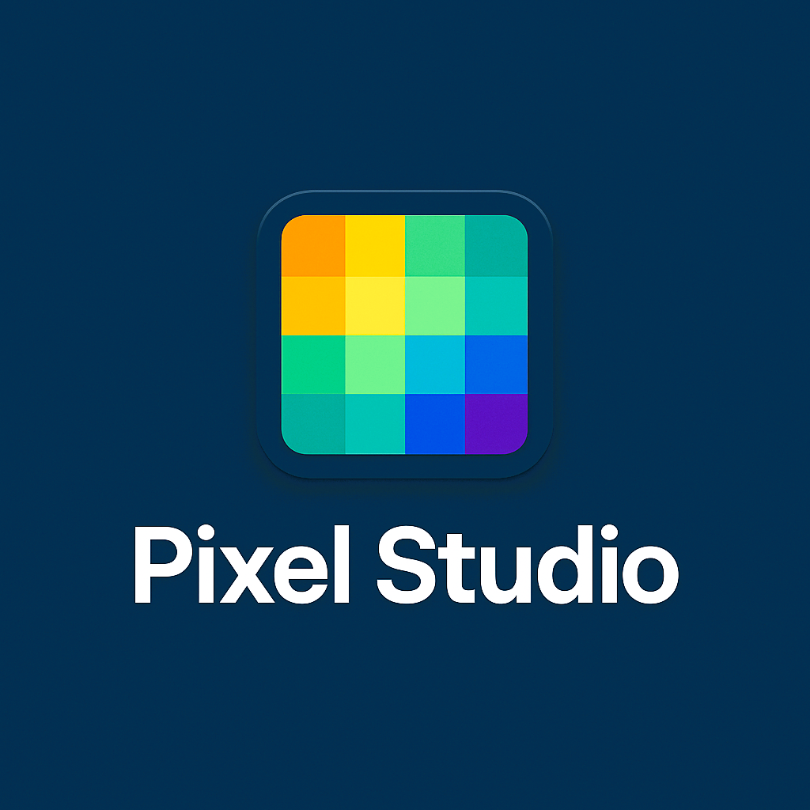

# 🎨 Pixel Studio

O **Pixel Studio** é um aplicativo desktop construído com **Next.js + Electron**, focado em oferecer uma experiência rápida e intuitiva para criação e edição de pixel art. O app é multiplataforma e conta com builds portáteis e instaladores automáticos.
<!-- logo do pixel studio com 25% do tamanho original -->

  <!-- Atualize com o path real do ícone -->


---

## 🚀 Tecnologias Utilizadas

- ⚛️ [Next.js](https://nextjs.org/)
- ⚡ [Electron](https://www.electronjs.org/)
- 💅 [TailwindCSS](https://tailwindcss.com/) 
- 🛠️ [Electron Builder](https://www.electron.build/)
- 🧠 [TypeScript](https://www.typescriptlang.org/)

---

## 📦 Requisitos

Antes de começar, você vai precisar ter instalado:

- [Node.js](https://nodejs.org/) (versão recomendada LTS)
- [npm](https://www.npmjs.com/) ou [yarn](https://yarnpkg.com/)
- Git (para clonar o projeto)

---

## 🧪 Modo de Desenvolvimento

```bash
# Instalar dependências
npm install

# Iniciar o modo dev (Next.js + Electron)
npm run dev
```

Esse comando inicia o servidor Next.js em `localhost:3000` e então abre a janela do Electron automaticamente.

---

## 🛠️ Scripts Disponíveis

```json
"scripts": {
  "dev": "concurrently \"npm run next\" \"npm run electron\"",
  "next": "next dev",
  "electron": "wait-on http://localhost:3000 && electron .",
  "electron:dev": "npm run dev",
  "build:next": "next build",
  "build:app": "npm run build:next && electron-builder",
  "postbuild:app": "node scripts/postbuild.js",
  "build": "npm run build:next && npm run build:electron && node postbuild.js",
  "start": "electron .",
  "lint": "next lint",
  "export": "cross-env NEXT_EXPORT=true next export"
}
```

---

## 🧱 Build do Projeto

### 🔧 Gerar Instalador `.exe`

```bash
npm run build:app
```

O instalador será salvo na pasta:  
```
release/exe/
```

### 📦 Gerar versão portable `.zip`

```bash
npm run build
```

Esse comando vai:

- Buildar o projeto
- Rodar o script `postbuild.js`
- Criar um arquivo `.zip` com o nome: `PixelStudio-portable-<versão>.zip`
- Salvar em:  
  ```
  release/portable/
  ```

---

## 🗂️ Estrutura de Pastas (resumida)

```
/public/assets/        # Ícones e imagens
/public/               # Arquivos públicos (favicon, etc)
/scripts/postbuild.js  # Script para build final e organização dos arquivos
/release/
  ├─ /exe/             # Instaladores
  └─ /portable/        # Versões zipadas portáteis
/main/                 # Entrada do Electron
/pages/                # Rotas do Next.js
```

---

## ❤️ Créditos

Feito com muito carinho por [Teuzin0dev](https://github.com/seu-user-aqui) 🚀  
Com apoio do ChatGPT 🤖

---

## 📄 Licença

Distribuído sob a licença MIT. Veja `LICENSE` para mais informações.

---

> Qualquer dúvida ou sugestão, abre uma issue ou manda um PR. Bora fazer esse app crescer! 🌟